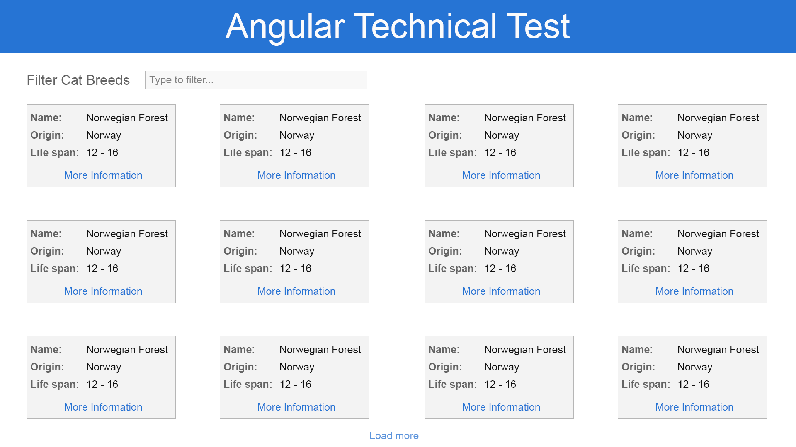

# Angular Interview Project

This project was generated with [Angular CLI](https://github.com/angular/angular-cli) version 8.0.6.

## Purpose

The purpose of this project is for the interviewee to demonstrate their familiarity with Angular, JavaScript/TypeScript and CSS.

## Requirements

- An IDE of the developers choice, e.g. Visual Studio Code, WebStorm, even Notepad will do!
- NPM 6.x (6.14.11 works well. Angular struggles with new versions of NPM)
- Node 10.15 or 14.15 will work

## Tasks
1. Get the project running
2. Match the visual layout show in 
3. Concentrate of the layout of the header and tiles. Closely match the colouring.
4. Add the load more feature. Show only 12 tiles, then 16, then 20 when clicking load more.
5. Add the filter to filter on the name property.

## Development server

Run `ng serve` for a dev server. Navigate to `http://localhost:4200/`. The app will automatically reload if you change any of the source files.

## Code scaffolding

Run `ng generate component component-name` to generate a new component. You can also use `ng generate directive|pipe|service|class|guard|interface|enum|module`.

## Build

Run `ng build` to build the project. The build artifacts will be stored in the `dist/` directory. Use the `--prod` flag for a production build.

## Running unit tests

Run `ng test` to execute the unit tests via [Karma](https://karma-runner.github.io).

## Running end-to-end tests

Run `ng e2e` to execute the end-to-end tests via [Protractor](http://www.protractortest.org/).

## Further help

To get more help on the Angular CLI use `ng help` or go check out the [Angular CLI README](https://github.com/angular/angular-cli/blob/master/README.md).
